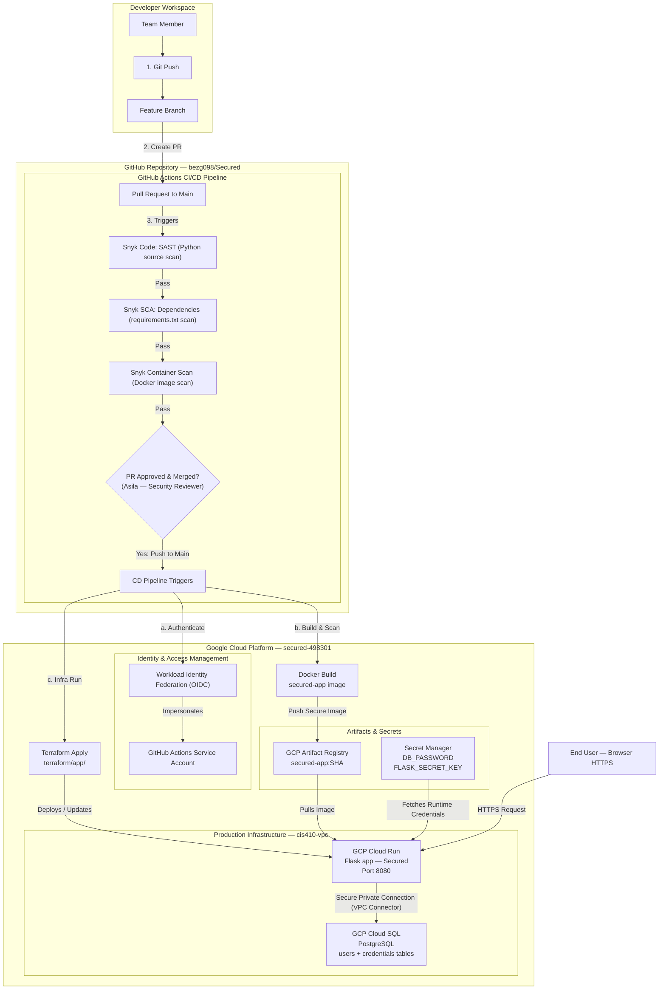

# 🔐 Secured — Credential Rotation Tracker

**CIS 410 — Cybersecurity Automation | Final Project Group 2**

A cloud-native web application for tracking and rotating credentials (API keys, passwords, certificates) across an organization. Built with Python Flask, deployed on Google Cloud Platform using Terraform, GitHub Actions CI/CD, and Snyk security scanning.

**Live App:** https://secured-app-330158972062.us-west1.run.app

---

## 👥 Team Members & Roles

| Name | Role | GitHub |
|------|------|--------|
| Abduba | Project Lead | bezg098 |
| Sayed / Abduba | Backend Engineer | nawidhashimi786-ui / bezg098 |
| Seela | Frontend Engineer | Seelalankara |
| Elis | DevSecOps Engineer | sudo-EM |
| Asefa | Security Reviewer | asefa-belete |

---

## 🏗️ Architecture



---

## 🛠️ Tech Stack

| Layer | Technology |
|-------|------------|
| Frontend | HTML / CSS / Jinja2 Templates |
| Backend | Python Flask + SQLAlchemy |
| Database | Cloud SQL PostgreSQL |
| Container Registry | GCP Artifact Registry |
| Hosting | Cloud Run |
| Infrastructure as Code | Terraform |
| CI/CD | GitHub Actions |
| Security Scanning | Snyk (SAST + SCA + Container) |
| Secret Management | GCP Secret Manager |
| Authentication | OIDC Workload Identity Federation |

---

## 📁 Project Structure

```
Secured/
├── backend/
│   ├── app.py                  # Flask application — login, dashboard, credentials, admin
│   ├── requirements.txt        # Flask, SQLAlchemy, psycopg2, gunicorn
│   ├── Dockerfile              # Containerizes Flask app, runs as non-root user
│   └── templates/              # Jinja2 HTML templates
│       ├── base.html           # Base layout with navbar
│       ├── login.html          # Login page
│       ├── register.html       # Registration page
│       ├── dashboard.html      # Credential dashboard with color-coded status
│       ├── add_credential.html # Add new credential form
│       └── admin.html          # Admin view — all users and credentials
├── terraform/
│   ├── infrastructure/         # VPC, Cloud SQL, Secret Manager, IAM (run once manually)
│   │   ├── main.tf
│   │   └── variables.tf
│   └── app/                    # Cloud Run, Artifact Registry (run by CI/CD pipeline)
│       ├── main.tf
│       └── variables.tf
├── .github/
│   └── workflows/
│       └── ci-cd.yml           # Full CI/CD pipeline — build, scan, push, deploy
├── .gitignore                  # Blocks .tfvars, .env, venv — no secrets committed
└── README.md
```

---

## 🚀 Deployment Guide

### Prerequisites
- GCP project with billing enabled
- GitHub repository
- Terraform installed
- gcloud CLI installed

### Step 1 — Enable GCP APIs
```bash
gcloud services enable \
  compute.googleapis.com \
  secretmanager.googleapis.com \
  cloudresourcemanager.googleapis.com \
  sqladmin.googleapis.com \
  vpcaccess.googleapis.com \
  run.googleapis.com \
  artifactregistry.googleapis.com \
  servicenetworking.googleapis.com \
  cloudbuild.googleapis.com \
  iam.googleapis.com \
  iamcredentials.googleapis.com \
  --project=YOUR_PROJECT_ID
```

### Step 2 — Set up OIDC for GitHub Actions
```bash
# Create Workload Identity Pool
gcloud iam workload-identity-pools create "github-pool" \
  --project="YOUR_PROJECT_ID" \
  --location="global" \
  --display-name="GitHub Actions Pool"

# Create Provider
gcloud iam workload-identity-pools providers create-oidc "github-provider" \
  --project="YOUR_PROJECT_ID" \
  --location="global" \
  --workload-identity-pool="github-pool" \
  --attribute-mapping="google.subject=assertion.sub,attribute.actor=assertion.actor,attribute.repository=assertion.repository" \
  --attribute-condition="assertion.repository=='YOUR_GITHUB_USERNAME/Secured'" \
  --issuer-uri="https://token.actions.githubusercontent.com"

# Create Service Account
gcloud iam service-accounts create "github-actions-sa" \
  --project="YOUR_PROJECT_ID"
```

### Step 3 — Add GitHub Variables
In GitHub repo → Settings → Secrets and Variables → Actions:

| Name | Type | Value |
|------|------|-------|
| `GCP_PROJECT_ID` | Variable | Your GCP project ID |
| `WIF_PROVIDER` | Variable | Workload Identity Provider path |
| `SA_EMAIL` | Variable | github-actions-sa@PROJECT.iam.gserviceaccount.com |
| `SNYK_TOKEN` | Secret | Your Snyk API token |

### Step 4 — Run Terraform Infrastructure (once)
```bash
cd terraform/infrastructure

# Create terraform.tfvars (never commit this file!)
cat > terraform.tfvars << 'EOF'
project_id       = "YOUR_PROJECT_ID"
region           = "us-west1"
db_password      = "YOUR_DB_PASSWORD"
flask_secret_key = "YOUR_FLASK_SECRET"
EOF

terraform init
terraform apply -var-file="terraform.tfvars"
```

### Step 5 — Build and Push Docker Image
```bash
gcloud builds submit \
  --tag us-west1-docker.pkg.dev/YOUR_PROJECT_ID/secured/secured-app:latest \
  --project=YOUR_PROJECT_ID \
  ./backend
```

### Step 6 — Deploy to Cloud Run
```bash
cd terraform/app

cat > terraform.tfvars << 'EOF'
project_id = "YOUR_PROJECT_ID"
region     = "us-west1"
image_tag  = "latest"
EOF

terraform init
terraform apply -var-file="terraform.tfvars"
```

### Step 7 — Create Database Tables
Connect via Cloud SQL Studio in GCP Console and run:
```sql
GRANT secured_user TO postgres;
GRANT ALL PRIVILEGES ON DATABASE secured_db TO secured_user;
GRANT ALL ON SCHEMA public TO secured_user;

CREATE TABLE IF NOT EXISTS users (
  id SERIAL PRIMARY KEY,
  username VARCHAR(80) UNIQUE NOT NULL,
  password VARCHAR(256) NOT NULL,
  is_admin BOOLEAN DEFAULT FALSE
);

CREATE TABLE IF NOT EXISTS credentials (
  id SERIAL PRIMARY KEY,
  name VARCHAR(120) NOT NULL,
  cred_type VARCHAR(60) NOT NULL,
  expires_on DATE NOT NULL,
  rotated BOOLEAN DEFAULT FALSE,
  user_id INTEGER REFERENCES users(id) NOT NULL,
  created_at TIMESTAMP DEFAULT NOW()
);

GRANT ALL ON ALL TABLES IN SCHEMA public TO secured_user;
GRANT ALL ON ALL SEQUENCES IN SCHEMA public TO secured_user;
```

---

## 💻 Local Development

```bash
# Clone the repo
git clone https://github.com/bezg098/Secured.git
cd Secured/backend

# Create virtual environment
python3 -m venv venv
source venv/bin/activate  # Mac/Linux
# venv\Scripts\activate   # Windows

# Install dependencies
pip install -r requirements.txt

# Set environment variables
export FLASK_SECRET_KEY=dev-secret
export DB_USER=secured_user
export DB_PASS=yourpassword
export DB_NAME=secured_db
export DB_HOST=localhost

# Run the app
python3 app.py
# Visit http://localhost:8080
```

---

## 🔐 Security Implementation

### IAM Least Privilege
The Cloud Run service account (`secured-cloudrun-sa`) has only:
- `roles/cloudsql.client` — connect to Cloud SQL
- `roles/secretmanager.secretAccessor` — read secrets

No editor or owner roles. No unnecessary permissions.

### Secret Management
All sensitive values stored in GCP Secret Manager:
- `secured-db-password` — PostgreSQL password
- `secured-flask-secret` — Flask session signing key

Never hardcoded in code or committed to GitHub.

### Branch Protection
- No direct pushes to `main`
- All changes via Pull Request
- Asila (Security Reviewer) must approve every PR
- Pipeline must pass before merge

### CI/CD Security Scanning
Every push to main triggers:
1. **Snyk SAST** — scans Python source code
2. **Snyk SCA** — scans requirements.txt for vulnerable packages
3. **Snyk Container** — scans Docker image
4. Pipeline fails on critical severity vulnerabilities

### OIDC Authentication
GitHub Actions authenticates to GCP using Workload Identity Federation — no long-lived service account keys stored anywhere.

### No Secrets in Git
`.gitignore` blocks:
- `*.tfvars` — Terraform secrets
- `.env` — environment files
- `venv/` — virtual environment

---

## 🔒 Security Commitments

- ✅ Least-privilege IAM — service accounts have only needed permissions
- ✅ No hardcoded secrets — all credentials in Secret Manager
- ✅ SAST integrated — Snyk Code runs on every push
- ✅ Container scanning — Snyk scans built image before push
- ✅ Branch protection — no direct pushes to main
- ✅ Peer PR review — Security Reviewer approves every PR
- ✅ terraform.tfvars gitignored — no secrets committed
- ✅ 0 Critical vulnerabilities in final Snyk scan

---

## 📊 Snyk Security Scan Results

- **Critical:** 0 ✅
- **High:** 1 (in pip third-party dependency, not app code)
- **Medium:** 19 (in pip/click third-party dependencies)
- **Low:** 34 (in pip third-party dependencies)

All issues found in virtual environment third-party packages, not in application code.

---

## 🌐 GCP Resources

| Resource | Name |
|----------|------|
| Project | secured-498301 |
| Cloud Run | secured-app |
| Cloud SQL | secured-db (PostgreSQL 15) |
| VPC | cis410-vpc |
| Artifact Registry | secured |
| Secret Manager | secured-db-password, secured-flask-secret |

---

## 📋 CI/CD Pipeline Stages

1. ✅ Checkout code
2. ✅ Authenticate to GCP (OIDC)
3. ✅ Configure Docker
4. ✅ Build Docker image
5. ✅ Snyk SAST scan
6. ✅ Snyk dependency scan
7. ✅ Snyk container scan
8. ✅ Push image to Artifact Registry
9. ✅ Deploy to Cloud Run

---

*CIS 410 Cybersecurity Automation — Highline College — Group 2*